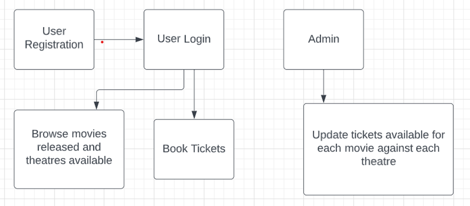
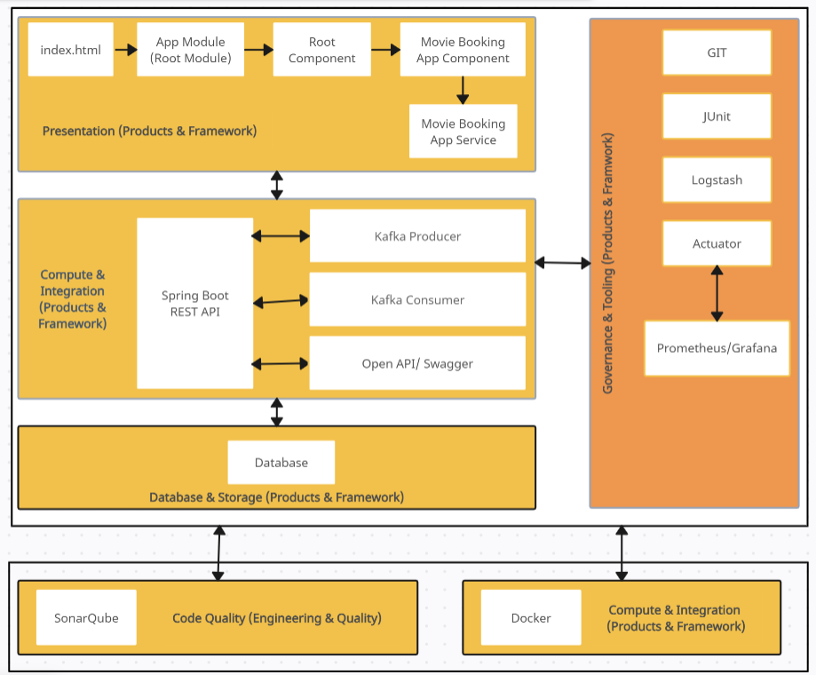
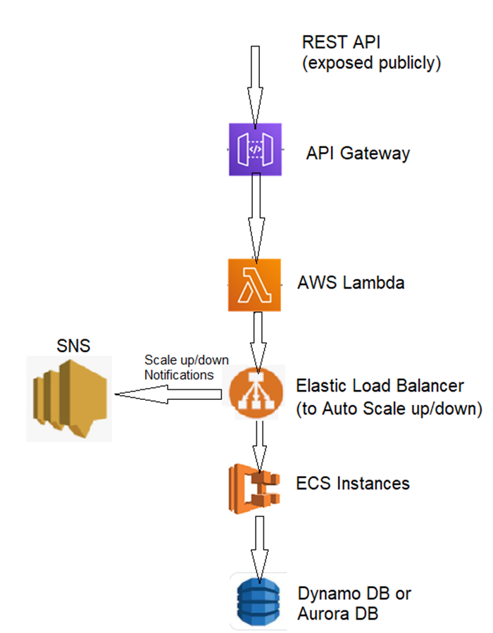

# FreezeMySeat_Application

# UseCase:

# 1. Problem Statement

The Movie Booking App is an application that allows users to register, log in, search for movies, and book tickets. Users can view available movies and theaters, book tickets, and admins can manage the ticket inventory.

# 2. Proposed Movie Booking App Wireframe

# 3. Application Architecture

# 4. Cloud Architecture

The diagram illustrates the deployment of the Movie Booking App on AWS Cloud.

# 5. Tool Chain

| Competency | Skill | Skill Detail |

| Engineering Mindset | Networking and Content Delivery | |

| ---- | Ways of Working | ---- |

| ---- | Consulting Mindset | ---- |

| | DevOps | |

| Programming Languages | Application Language | Java |

| Products & Frameworks | Presentation | Angular/React |

| | | Karma & Jasmine |

 | | Compute & Integration | Spring Boot |

 | | | Kafka/Kube MQ/ActiveMQ/Rabbit MQ |

 | | | Docker |

 | | Database & Storage | MySQL/Cassandra/Redis |

 | | Governance & Tooling | Git |

 | | | Maven |

 | | | JUnit |

 | | | Mockito |

 | | | Logstash |

 | | | Prometheus & Grafana |

 | Engineering Quality | Code Quality | Sonar Cube |

 | Platform | Cloud Tools | AWS ECS |

 | | | AWS DynamoDB/Aurora |

 | | | AWS Lambda |

 | | | AWS Elastic Cache |

 | | | AWS Code Deploy |

 | | | AWS API Gateway |

 | | | AWS Elastic Load Balancer |

 | | | AWS SNS |

# 6. Development Flow

 | No | MC | Competency | Section | Indicative Mechanism for Evaluation |

 | 1 | Backend | Rest API, Database, Messaging, Log/Monitoring, Debugging & Troubleshooting | Click here | Code Submission and Evaluation, Panel Presentation |

 | 2 | Frontend | Angular/React | Click here | Code Submission and Evaluation, Panel Presentation |

 | 3 | Cloud | Compute, Identity, Compliance, Security and Content Delivery | Click here | Code Submission and Evaluation, Panel Presentation |

# 7. Business Requirement

As an application developer, develop frontend, middleware and deploy the Movie Booking App with below guidelines:

# Pre-requisite before implementing the user story:

Create a static database as “Movie” and add the below fields
• Movie name, Total number of tickets allotted and theatre name (Movie name and theatre name should be of composite primary key)
There should be a predefined set of tickets assigned to each theatre against each movie. Just create sample 2 movies with 2 theatres assigned. This will be used for the upcoming user story to fetch the data.

 | User Story # | User Story Name | User Story |

 | #US_01 | Registration and Login | As a user, I should be able to login/Register in the movie booking application.

Acceptance Criteria:

1. A logged-in user can login, forget their password, and reset their password.
2. A logged-in user cannot change their username.
3. A logged-in user can logout from their account.
4. A customer should provide First Name, Last Name, Email, Login Id, Password, Confirm Password, and Contact Number during registration.
5. All details fields are mandatory.
6. Login Id and Email must be unique.
7. Password and Confirm Password must match.
8. Show validation messages if any constraint is not satisfied. |

---

 | #US_02 | View & Search Movies | As a user, I should be able to view all the recent movies opened for booking. User can search for any particular movie.

Acceptance Criteria:

1. User can view all released movies.
2. User can search for movies based on the movie name. |

---

 | #US_03 | Book Tickets for a Movie | As a user, I should be able to book tickets for a movie and add the booking to a "Tickets" database table. Movie name and theatre name should be foreign keys in the "Tickets" table.

Acceptance Criteria:

1. User can book a movie ticket.
2. Details to be added: Movie Name, Theatre Name, Number of Tickets, Seat Number. |

---

 | #US_04 | View Booked Tickets and Update Ticket Status | As an admin, I should be able to view booked tickets and update the available tickets for a movie.

Acceptance Criteria:

1. Admin can view booked tickets for a particular movie.
2. Check available tickets from the "Movie" table.
3. If quantity is 0, update ticket status as 'SOLD OUT'; else update as 'BOOK ASAP'. |

---

# 8. Rubrics/Expected Deliverables

    8.1 REST API:
        a.Use Spring Boot for REST endpoints.
        b. Implement HTTP methods: GET, POST, PUT, DELETE, PATCH.
        | Method Type | Method value | Description |
        ---------------------------------------------------
        | POST | /api/v1.0/moviebooking/register | Register as a new User |
        ---------------------------------------------------
        | POST | /api/v1.0/moviebooking/register | Register as a new User |
        ---------------------------------------------------
        | POST | /api/v1.0/moviebooking/register | Register as a new User |
        ---------------------------------------------------
        | POST | /api/v1.0/moviebooking/register | Register as a new User |
        ---------------------------------------------------
        | POST | /api/v1.0/moviebooking/register | Register as a new User |
        ---------------------------------------------------
        | POST | /api/v1.0/moviebooking/register | Register as a new User |
        ---------------------------------------------------
        | POST | /api/v1.0/moviebooking/register | Register as a new User |
        ---------------------------------------------------
        | POST | /api/v1.0/moviebooking/register | Register as a new User |
        ---------------------------------------------------
        c. Movie name may be partial or complete username
        d.	Use necessary configuration in place for REST API in application. Properties or bootstrap. Properties or application.yml; whichever is applicable.
        e.	Package Structure for Spring Boot Project will be like com. moviebookingapp. With proper naming conventions for package and beans.
        f.	Use configuration class annotated with @Configuration and @Service for business layer.
        g.	Use constructor-based dependency injection in few classes and setter-based dependency injection in few classes.
        h.	Follow Spring Bean Naming Conventions

    8.2 Database
        1. As an application developer:
            a.	Implement ORM with Spring Data MongoRepositoryand MongoDB. For complex and custom queries, create custom methods and use @Query, Aggregations (Aggregation Operation, Match Operation, Aggregation Results), implementation of MongoTemplateetc as necessary.
            b.	Have necessary configuration in place for REST API in application.properties or bootstrap.properties or application.yml OR Java based configuration; whichever is applicable.

    8.3 Maven
        1.	As an application developer:
            a.	Create the spring boot project using Maven CLI
            b.	Generate Surefire test reports and share it as a part of deliverables
            c.	Using Maven CLI generate the project documentation, and share it as a part of deliverables

    8.4 Messaging
        1.	As an application developer:
            a.	Have a centralized logging system
            b.	Be able to communicate using a messaging infrastructure.
            c.	Use KafkaTemplate for communication with Spring boot and topics in Kafka.
            d.	Use Kafka for messaging infrastructure and implement admin to read the total number of tickets booked for a movie and available quantity from movie table and admin to write the ticket availability status as provided in the user story.
            e.	Configure Spring boot app to log all logging messages to Kafka.
            f.	Configure all Kafka related configuration needed for Spring Boot in *.properties or *.yml file.

    8.5 Log/Monitoring
        1.	As an application developer:
            a.	Containerize the complete application, which includes front-end, middleware and Kafka (consumers and producers) using docker and Dockerfile.
            b.	Use. dockerignore as necessary to avoid containerizing un-necessary packages.
            c.	Integrate Spring Boot Actuator with Prometheus and Grafana to monitor middleware.
            d.	Implement logs with Logstash.
            e.	Open the preconfigured Logstash in Kibana and check if it successfully connects to Elasticsearch Server.
            f.	Perform unit and integration testing of your application and do proper CI/CD

    8.6 Debugging & Troubleshooting
        Generate bug report & error logs - Report must be linked with final deliverables which should also suggest the resolution for the encountered bugs and errors.

# 9. Frontend

    1.	Develop the front end for all user stories.
    2.	Implement using either Angular or React
    3.	Implement all the Front-End validation rules
    4.	Proper naming conventions and folder structures
    5.	Implement using proper SOLID design principles
    6.	Perform unit and integration testing for the front-end application

# 10. Platform

    10.1 Compute
        1.	Use ECS CLI (as an alternative to AWS Management Console) for container management and deployment of spring boot application. You should be able to explain and demonstrate the same in interview.
        2.	Use NoSQL instance of AWS DynamoDB/Aurora (SQL) as a database for the Movie Booking App Application

    10.2 Compute, Identity & Compliance, Security & Content Delivery
        1.	Use AWS Lambda and AWS Aurora to build a backend process for handling requests for Movie Booking App.
        2.	Use Serverless Java Container using AWS ECS and run the Movie Booking app created with Spring Boot inside AWS Lambda.
        3.	Use Amazon API Gateway to expose the lambda functions built in the previous step to be accessible on public internet.
        4.	Use AWS ELB to configure the auto-scaling container instances.
        5.	Configure AWS SNS to issue messages whenever a ELB scales-up and scale-down container instances

Note – Minimum two rest endpoints should be hosted in cloud.
10.3 Frontend Deployment
Deploy the Frontend solution as follows: 1. Maintain the production build of Frontend application on S3 bucket. 2. Configure an EC2 instance to access Frontend artifacts from S3 bucket and expose it as dynamic web application. 3. Configure the S3 to cache the JavaScript build files. 4. Configure the Route 53 to register domain name to expose the Frontend solution. 5. Ensure that Privacy Protection feature is enabled for Amazon Route 53 domain.

# 11. Methodology

    11.1 Agile
        1.	As an application developer, use project management tool along to update progress as you start implementing solution.
        2.	As an application developer, the scope of discussion with mentor is limited to:
            a.	Q/A
            b.	New Ideas, New feature implementations and estimation.
            c.	Any development related challenges
            d.	Skill Gaps
            e.	Any other pointers key to UI/UX and Middleware Development.
